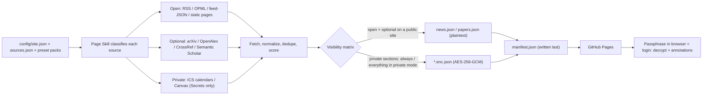

<div align="center">

# Relevance

## Collecting News/Papers/Blogs Relevant to You in One Place

*What feels important is simply what we happen to select from the possibilities of a particular moment to address the needs of that moment and to cope with its contingencies—what, in recent pragmatist Robert Brandom's words, we let "pop to the surface and float in a sea of random variability."*  

*—Tamarkin, 2022, Apropos of Something: A History of Irrelevance and Relevance*

[](docs/SETUP.md)
[](.github/workflows/update.yml)
[](skills/newsdash/README.md)
[](docs/SETUP.md)
[](LICENSE)

[中文](README.zh.md) · [Setup guide](docs/SETUP.md) · [Security model](docs/SECURITY_MODEL.md) · [Page Skill](skills/newsdash/README.md) · [Data contract](docs/DATA_CONTRACT.md)

</div>

---
## What is this?

The contemporary internet can be overwhelming. We don't always read what we want to read or see what we want to see. The 15-second YouTube ads guess what we need and often try to convince us that what they show is what we want. This enshittified environment is, in other words, not relevant to us.

*Relevance* is a **GitHub template repository** tailoring relevant information streams specifically for you. It is the successor to [LearnPrompt/ai-news-radar](https://github.com/LearnPrompt/ai-news-radar) (Scout Skill｜伯乐Skill), and it collects scattered news from different sources, selects the news that is of the most interest to you, and generates a webpage hosted on GitHub (for free), which updates every few hours automatically, and you can read it on both your computer and phone.

To do that, you can create your own repository with this template, and it will generate a website for you ([see the instructions below](#quick-start)). Then, you can use the in-repo AI agent (page skill and 书童 skill) to customize the sources that you are interested in.

It is designed to help those who need to cope with a large amount of information and want to let the information they care about "pop to the surface and float in a sea of random variability." For researchers, Relevance tracks the recent papers in the field. For developers, it traces the latest technological stacks. For investors, it obtains the most relevant business reports.
---
## Main Functions
- **Collecting news, recent papers, and trends:** The app supports RSS and an in-built collector to fetch the latest news online.
- **Generating a website:** A website will be deployed with the collected news.
- **Auto-Update:** The website will be updated automatically. By default, it refreshes every two hours. You can change it easily ([see the instructions below](#automatic-updategithub-actions-and-configuration)).
- **AI Summary (need an LLM API key):** Use an LLM to score the news according to your interest, and generate a total summary on the homepage.
- **Today's Image (need an LLM API key and Smithsonian API key):** Let an LLM generate keywords according to the collected sources, and then search the [Smithsonian Open Access](https://www.si.edu/openaccess) and select an image that matches the main themes of the day.
- **Private Modes:** There are two layers of meaning regarding private modes: full private mode and private visibility. The first one is that the whole webpage you deploy is encrypted ([see the instructions below](#private-mode-and-its-management)) and requires a passphrase to visit. Private visibility means that some information is only visible to you, like favorites, highlights, and notes. So, setting a passphrase is necessary.
- **Favorite, annotations, and notes:** You can also highlight the texts that you collected, which are stored in your local cookies. This is only visible to you, and you need to set up the passphrase to read them.
- **Themes:** There are several themes available. Currently, `The Type` is the most functional one.
- **Apropos of nothing (In development, need an LLM API key):** While this app helps you to collect the most relevant information, it also tries to display totally irrelevant information to break the echo chamber a little bit.

---
## Quick start

### Route A — template (no local setup)
If you want to make a webpage and host it online, please use this route.

1. Click **Use this template → Create a new repository** (public repo recommended — see [cron notes](#automatic-updategithub-actions-and-configuration)).
2. Go to the **Actions** tab and enable workflows (GitHub shows a banner on templated repos). Run **Update Relevance** once via *Run workflow*, or wait for the cron — the first zero-secret build goes green with the default presets.
3. **Settings → Pages → Deploy from a branch → `main` / `(root)`**. Your dashboard is live.
4. Open **Issues → New issue → "Set up my Relevance · 配置我的及君"** and fill in the form: language, visibility, theme, title, timezone, preset packs, extra RSS, interest keywords. The setup workflow (owner-guarded) commits your config, re-runs the build, and replies with a bilingual comment — Pages link, secrets deep links, base64 recipes, and the agent kickoff prompt.
5. For Private / Optional sources, add the secrets listed in that comment (or follow the [setup guide](docs/SETUP.md)) — every source turns itself on the moment its key exists.

### Route B — local
If you want to run it locally or on your own server, please use this route.

```bash
git clone https://github.com/<your-username>/<your-repo>.git
cd <your-repo>
python3 -m venv .venv && source .venv/bin/activate
pip install -r requirements.txt
python scripts/build.py --output-dir data
python -m http.server 8899
```

Open:

```text
http://localhost:8899
```

Useful extras: `--smoke` (no network, valid-but-empty outputs), `--only open|private|optional` (debug one category), `python scripts/validate_config.py` (schema-check your config), `python -m pytest -q` (81 tests), `node tests/test_crypto_webcrypto.mjs` (browser-side crypto against a Python-encrypted vector). `scripts/encrypt_tool.py encrypt|decrypt|make-vector` works with the passphrase in an env var — never on argv.

For a more detailed guideline, please read [the setup guide](docs/SETUP.md).

---
## Tutorial for agents

After the initial deployment, you can use Claude Code / Codex to employ the Page Skill and the 书童 Skill to customize your sources. Paste this:

```text
Use Page Skill for Relevance. Interview me first: which preset packs I want
(ai-news, general-news, academic-datavis, academic-techcomm), my interest keywords,
my theme and timezone, and whether the site should be public or private. Then classify
any extra sources I give you as Open, Private, or Optional. Walk me through every
GitHub secret step by step — but never ask me to paste a secret value into the chat,
and never commit tokens, calendar URLs, or passphrases into the repo.
```

The skill **narrates** secrets setup — which secret to create, where, and how to encode it — but never touches the values themselves. A secret is a GitHub function that stores sensitive information like LLM API keys and passphrases. To know more, [see the instructions below](docs/SETUP.md).

- `skills/newsdash/` — **Page Skill｜书童** (maintainer side): classify sources, maintain the pipeline and config, guide deployment. See its [README](skills/newsdash/README.md).
- A reader-side consumer skill (ask your agent "what's on my Relevance today?") is planned for v0.2.
---
## Automatic Update—GitHub Actions and configuration

`.github/workflows/update.yml` is preconfigured:

- **Cron: `17 */2 * * *`** (2-hourly, off the congested top of the hour). That's roughly 900 Actions minutes/month — safely inside the 2000 free minutes private repos get. On a public repo (unlimited minutes) you may drop to `*/30 * * * *`.
- The bot commits the whole `data/` directory back and self-checks that nothing generated was left unstaged.
- **Key present ⇒ on:** sources with `enabled: "auto"` run iff every env var in their `secret_ref` is set. No key, no fetch, no error — the section just reports `not_configured` and the site shows a setup hint.
- Heads-up: GitHub disables cron schedules after ~60 days of repo inactivity (one click re-enables); the Pages CDN caches ~10 minutes, which the rotating `build_id` defeats; data commits grow history over time (windows are rolling — a squash recipe is in the docs).

## Private Mode and Its Management

| Secret | Unlocks | Notes |
|---|---|---|
| `NEWSDASH_PASSPHRASE` | All encryption | Use ≥4 random words. Rotation = change secret + re-run (old ciphertext stays in git history) |
| `ICS_SOURCES_B64` | `schedule` section | Base64 of a JSON array `[{id,name,url}]` — see `examples/ics-sources.example.json`. Encode: `base64 -i ics-sources.json \| tr -d '\n'` (macOS) / `base64 -w0 ics-sources.json` (Linux) |
| `CANVAS_BASE_URL` | `courses` section | e.g. `https://canvas.iastate.edu` |
| `CANVAS_TOKEN` | `courses` section | Canvas → Account → Settings → **+ New Access Token**. Tokens are full-account — rotate each semester |
| `OPENALEX_API_KEY` | Optional | OpenAlex now rejects most keyless requests; without a key that fetcher is best-effort |
| `FOLLOW_OPML_B64` | Optional | Your radar-compatible OPML, decoded to `feeds/follow.opml` at build time |
| `LLM_API_KEY` | Optional — AI daily brief | Your own key for an OpenAI-Chat-Completions-compatible endpoint (OpenAI, OpenRouter, Groq, Together, self-hosted, …). Off by default; see below |
| `SMITHSONIAN_API_KEY` | Optional — Today's Image | Free key from [api.data.gov/signup](https://api.data.gov/signup/) (works across every api.data.gov API). Requires `LLM_API_KEY` too |

### Variables (kill switches + tuning)

| Variable | Purpose |
|---|---|
| `CONTACT_MAILTO` | Joins the CrossRef/OpenAlex polite pools (better rate limits) |
| `ICS_CALENDARS_ENABLED` / `CANVAS_ENABLED` | Set `0` for an emergency stop of that source |
| `RSS_MAX_FEEDS` | Cap on OPML feeds (default 10) |
| `LLM_BASE_URL` / `LLM_MODEL` | Endpoint + model for the AI daily brief (defaults: `https://api.openai.com/v1`, `gpt-4o-mini`) |
| `LLM_SUMMARY_ENABLED` / `TODAYS_IMAGE_ENABLED` | Set `0` for an emergency stop of either feature, keeping the key |

Policy line, worth memorizing: **keys live in Secrets; tuning lives in config files; Variables exist only as kill switches.**

### Optional AI enrichment

Off by default, server-side only (your own key, never a visitor-supplied one), and budget-gated: at most two short LLM calls and one image-archive search per scheduled build (every ~2h), never per visitor. Add `LLM_API_KEY` to get an AI-written daily brief plus a one-line summary on the Today page's "Top stories" and "Top papers" blocks. Add `SMITHSONIAN_API_KEY` too and a **Today's Image** block appears: a public-domain image from the [Smithsonian Open Access API](https://www.si.edu/openaccess), loosely and creatively matched to the day's content, with a one-sentence AI caption and a source link. Only images explicitly marked `CC0` by the Smithsonian are ever shown. The enrichment reads only your `news`/`papers` items — never schedule or courses. See [CONFIG_REFERENCE.md](docs/CONFIG_REFERENCE.md) for the full contract.

Everything else is plain JSON under `config/` — `site.json` (title, visibility, theme, timezone, time windows) and `sources.json` (presets, interests, sources), both JSON-Schema validated. The schema **forbids** `url`/`path` on `category: "private"` sources, so a capability URL can never leak into the repo by config mistake.

## Privacy and security

- **Private mode is passphrase encryption, not access control.** The pipeline encrypts with AES-256-GCM; the key is PBKDF2-HMAC-SHA256 over your NFC-normalized passphrase (16-byte salt, 600 000 iterations); your browser decrypts via WebCrypto. `visibility: "public"` keeps open + optional sections plaintext while private sections are always encrypted; `visibility: "private"` encrypts everything and boots the site to a passphrase gate.
- **Secrets never touch the repo.** Calendar capability URLs and Canvas tokens live only in GitHub Secrets; Actions logs withhold private-section counts, titles, and error detail; `source-status.json` redacts private sources down to an aggregate.
- **The ciphertext is public, so the passphrase carries the load.** Weak passphrases can be brute-forced offline — use at least 4 random words. Metadata (file sizes, update cadence, which sections you configured) still leaks and is documented, not hidden.

> **A private site is an encrypted public site — not a private repo.** GitHub Pages is always publicly reachable on free plans.

Threat model, tradeoffs, and the full invariants list: [docs/SECURITY_MODEL.md](docs/SECURITY_MODEL.md).
---
## How it works



Each source is fetched in isolation — one failure never kills the build. Items are deduped by canonical URL (UTM stripped), DOI-first for papers, then title fingerprint. Scoring is `0.45 · recency (exponential decay, 12 h half-life for news / 84 h for papers) + 0.35 · interest-keyword relevance + 0.20 · source weight`. Events and courses are never scored — they stay time-ordered. `manifest.json` is written last as the frontend's atomic commit point.

## Data outputs

Every run regenerates a set of static JSON files under `data/` — the page reads only these. Full schemas live in the [data contract](docs/DATA_CONTRACT.md).

| File | What's inside | Visibility |
|---|---|---|
| `manifest.json` | Discovery: site config, section list, crypto check block, `build_id` for cache busting | **Always plaintext** |
| `news.json` | Open news items, 24 h window, deduped and scored | Plaintext when `visibility: "public"`; encrypted in private mode |
| `papers.json` | Optional scholarly items, 7-day window, authors/venue/DOI | Plaintext when public; encrypted in private mode |
| `schedule.enc.json` | Calendar events, RRULE-expanded in your timezone | **Always encrypted** |
| `courses.enc.json` | Canvas announcements + upcoming assignments with submission state | **Always encrypted** |
| `source-status.json` | Per-source fetch health; private sources appear only as an aggregate — their detail rides inside the encrypted payloads | Plaintext when public; encrypted in private mode |
| `archive.json` | Rolling 14-day archive of open + optional items (cap 3000) | Plaintext when public; encrypted in private mode |

Before the first successful run, the manifest reports `status: "awaiting_first_build"` and the site renders an onboarding screen instead of an empty page.

---


## License

[MIT](LICENSE)
