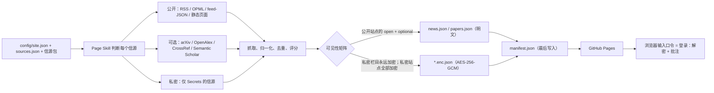

<div align="center">

# 及君 Relevance

## 一处汇集：与你相关的新闻、论文与博客

*所谓「重要」，不过是我们从某一时刻的诸种可能性中，为应对那一刻的需求、化解其偶然性而恰好选中的东西——用晚近实用主义者罗伯特·布兰顿（Robert Brandom）的话说，就是我们任由其"浮出水面、漂浮在随机变异的海洋里"的东西。*

*——塔玛金（Tamarkin），2022，《说来无关：一部无关与相关的历史》（Apropos of Something: A History of Irrelevance and Relevance）*

[](docs/SETUP.zh.md)
[](.github/workflows/update.yml)
[](skills/newsdash/README.md)
[](docs/SETUP.zh.md)
[](LICENSE)

[English](README.md) · [配置指南](docs/SETUP.zh.md) · [安全模型](docs/SECURITY_MODEL.zh.md) · [Page Skill](skills/newsdash/README.md) · [数据契约](docs/DATA_CONTRACT.md)

</div>

---
## 这是什么？

当下的互联网令人应接不暇。我们并不总能读到自己想读的、看到自己想看的。15 秒的 YouTube 广告猜测我们的需求，还常常想说服我们：它展示的正是我们想要的。这个被"劣化"（enshittified）的环境，换句话说，与我们并不相关。

**及君**（Relevance）是一个 **GitHub 模板仓库**，专为你打造与你相关的信息流。它是 [LearnPrompt/ai-news-radar](https://github.com/LearnPrompt/ai-news-radar)（伯乐Skill｜Scout Skill）的续作，从分散的信源中收集新闻，挑出你最感兴趣的部分，并生成一个托管在 GitHub 上（免费）的网页，每隔几小时自动更新，电脑和手机都能读。

要做到这一点，你可以用这个模板创建自己的仓库，它就会为你生成一个网站（[见下文说明](#快速开始)）。然后，你可以用仓库内置的 AI 智能体（Page Skill 与书童 Skill）来定制你感兴趣的信源。

它是为那些需要应对海量信息、并希望让自己在意的信息"浮出水面、漂浮在随机变异的海洋里"的人设计的。对研究者，及君追踪该领域的最新论文；对开发者，它追踪最新的技术栈；对投资者，它获取最相关的商业报告。

---
## 主要功能
- **收集新闻、最新论文与趋势：** 应用支持 RSS，并内置抓取器获取最新的在线新闻。
- **生成网站：** 收集到的新闻会被部署为一个网站。
- **自动更新：** 网站会自动更新，默认每两小时刷新一次，你也可以轻松修改（[见下文说明](#自动更新github-actions-与配置)）。
- **AI 摘要（需要 LLM API Key）：** 用 LLM 按你的兴趣给新闻打分，在首页生成总摘要，并在页末加入一张离题新闻卡片。
- **线索 · Threads（需要 LLM API Key）：** 每天由 LLM 挑出 5–6 个多个信源共同触及的关键词，双语呈现，每条都附逐信源的角度、直接链回原始条目，配一个收敛度图标与一句「为何是现在」的说明。兼容任何 OpenAI 协议端点（DeepSeek、OpenAI、OpenRouter、Ollama……），未配置 LLM Key 时优雅回退到经典的 Highlights 区块。
- **今日一图（需要 LLM API Key 与 Smithsonian API Key）：** 让 LLM 根据当天收集到的信源生成关键词，再到 [Smithsonian Open Access](https://www.si.edu/openaccess) 检索一张与当日主题相符的图片。
- **私密模式：** "私密"在这里有两层含义：完整私密模式与私密可见性。前者是指你部署的整个网页都被加密（[见下文说明](#私密模式及其管理)），需要口令才能访问；私密可见性则是指部分信息只对你自己可见，比如收藏、高亮与笔记。因此，设置一个口令是必要的。
- **收藏、批注与笔记：** 你也可以高亮收集到的文字，这些内容存放在你本地的浏览器存储中，只有你能看到，且需要设置口令才能读取。
- **主题：** 三套主题，各自改编自知名的开源设计——`the-type`（字砌，排版优先的衬线，功能最完整；灵感来自 [The Type](https://www.thetype.com/)）、`papermod`（纸墨，简洁的系统无衬线卡片；改编自 [hugo-PaperMod](https://github.com/adityatelange/hugo-PaperMod)）、`blowfish`（河豚，低调紫色；改编自 [Blowfish](https://github.com/nunocoracao/blowfish)）。三套主题都带有平滑的错落淡入过渡，以及随滚动渐显的整幅模糊吸顶页头。每套主题都配有专门设计的深色版本——默认跟随系统，可在设置中切换 浅色/深色/自动，页头也有 ☀/☾ 切换按钮。
- **无关一则（需要 LLM API Key）：** 这个应用在帮你收集最相关信息的同时，也会让你的 LLM 找一条完全无关的公开新闻，附短摘要与来源链接，稍微打破一下你的信息茧房。

---
## 快速开始

### 路线 A——模板（无需本地环境）
如果你想生成一个网页并托管上线，请用这条路线。

1. 点击 **Use this template → Create a new repository**（建议公开仓库——原因见 [Actions 配置](#自动更新github-actions-与配置)）。
2. 打开 **Actions** 标签页启用工作流（模板仓库会显示提示条）。用 *Run workflow* 手动跑一次 **Update Relevance**，或等定时任务——第一次零密钥构建即可用默认信源包出结果。
3. **Settings → Pages → Deploy from a branch → `main` / `(root)`**。你的仪表盘就上线了。
4. 打开 **Issues → New issue → 「Set up my Relevance · 配置我的及君」**，填表：语言、可见性、主题、标题、时区、信源包、自定义 RSS、兴趣关键词。配置工作流（仅响应仓库所有者）会提交你的配置、重新构建，并用中英双语回帖：Pages 链接、Secrets 清单与直达链接、base64 配方、AI 启动提示词。
5. 私密 / 可选信源：按回帖清单添加 Secrets（或看[配置指南](docs/SETUP.zh.md)）——密钥一旦存在，对应信源即自动开启。

### 路线 B——本地
如果你想在本地或自己的服务器上运行，请用这条路线。

```bash
git clone https://github.com/<your-username>/<your-repo>.git
cd <your-repo>
python3 -m venv .venv && source .venv/bin/activate
pip install -r requirements.txt
python scripts/build.py --output-dir data
python -m http.server 8899
```

打开：

```text
http://localhost:8899
```

其他常用命令：`--smoke`（不联网，产出合法的空数据）、`--only open|private|optional`（按类别调试）、`python scripts/validate_config.py`（校验配置）、`python -m pytest -q`（81 个测试）、`node tests/test_crypto_webcrypto.mjs`（用 Python 加密的测试向量验证浏览器侧解密）。`scripts/encrypt_tool.py encrypt|decrypt|make-vector` 从环境变量读取口令——绝不走命令行参数。

更详细的指引，请阅读[配置指南](docs/SETUP.zh.md)。

---
## 给 Agent 看的教程

完成初次部署后，你可以用 Claude Code / Codex 调用 Page Skill 与书童 Skill 来定制你的信源。粘贴这段：

```text
Use Page Skill for Relevance. Interview me first: which preset packs I want
(ai-news, general-news, academic-datavis, academic-techcomm), my interest keywords,
my theme and timezone, and whether the site should be public or private. Then classify
any extra sources I give you as Open, Private, or Optional. Walk me through every
GitHub secret step by step — but never ask me to paste a secret value into the chat,
and never commit tokens or passphrases into the repo.
```

这个技能只会**口述** Secrets 配置——建哪个、在哪建、值怎么生成——但绝不经手值本身。Secret 是 GitHub 提供的一项功能，用来存放 LLM API Key、口令之类的敏感信息。想了解更多，[见下文说明](docs/SETUP.zh.md)。

- `skills/newsdash/` —— **Page Skill｜书童**（维护侧）：信源分类、维护流水线与配置、指导部署。见其[说明页](skills/newsdash/README.md)。
- 读者侧的消费 Skill（对 Agent 说「今天我的及君上有什么？」）排在 v0.2。

---
## 自动更新——GitHub Actions 与配置

`.github/workflows/update.yml` 已经配好：

- **Cron：`17 */2 * * *`**（每 2 小时，避开整点拥堵）。约合每月 900 分钟 Actions 用量——稳稳低于私有仓库每月 2000 分钟的免费额度。公开仓库（分钟数不限）可以放心改成 `*/30 * * * *`。
- 机器人把整个 `data/` 目录提交回仓库，并自检没有遗漏任何生成文件。
- **有密钥就自动开**：`enabled: "auto"` 的信源只在 `secret_ref` 列出的环境变量齐备时运行。没密钥就不抓、也不报错——栏目只显示 `not_configured`，页面给出配置提示。
- 注意：仓库约 60 天无活动后 GitHub 会自动停掉定时任务（一键恢复）；Pages CDN 缓存约 10 分钟，靠轮换的 `build_id` 破解；数据提交会让历史慢慢变大（窗口是滚动的，压缩配方见文档）。

## 私密模式及其管理

| Secret | 开启 | 备注 |
|---|---|---|
| `NEWSDASH_PASSPHRASE` | 全部加密 | 至少 4 个随机单词。轮换 = 改 Secret + 重跑（旧密文仍留在 git 历史里） |
| `OPENALEX_API_KEY` | 可选 | OpenAlex 现在大多拒绝免密钥请求；无 Key 时该信源尽力而为 |
| `FOLLOW_OPML_B64` | 可选 | 兼容雷达的私人 OPML，构建时解码到 `feeds/follow.opml` |
| `LLM_API_KEY` | 可选——AI 每日简报 + 无关一则 | 你自己的 OpenAI Chat Completions 兼容端点 Key（OpenAI、OpenRouter、Groq、Together、自建服务等）。默认关闭，见下文 |
| `SMITHSONIAN_API_KEY` | 可选——今日一图 | 在 [api.data.gov/signup](https://api.data.gov/signup/) 免费申请（该 Key 通用于所有 api.data.gov API）。需同时配置 `LLM_API_KEY` |

### Variables（急停开关 + 微调）

| Variable | 用途 |
|---|---|
| `CONTACT_MAILTO` | 加入 CrossRef/OpenAlex 的礼貌池（更好的限速待遇） |
| `RSS_MAX_FEEDS` | OPML 展开的订阅数上限（默认 10） |
| `LLM_BASE_URL` / `LLM_MODEL` | AI 增强功能的端点与模型（默认：`https://api.openai.com/v1`、`gpt-4o-mini`） |
| `LLM_SUMMARY_ENABLED` / `TODAYS_IMAGE_ENABLED` / `APROPOS_OF_NOTHING_ENABLED` | 设为 `0` 即可急停对应 AI 功能，同时保留 Key |

一句话方针，值得背下来：**密钥进 Secrets；调参进配置文件；Variables 只当急停开关。**

### 可选 AI 增强功能

默认关闭，仅在服务端运行（用你自己的 Key，绝非访客提供的 Key），且有预算控制：只随定时构建（约每 2 小时一次）运行，绝不按访客次数调用。配置 `LLM_API_KEY` 后，今日页面会出现 AI 撰写的每日简报、「头条」「优选论文」栏目各一行摘要，以及「无关一则」卡片：一条刻意偏离当前信息流的公开新闻，附 AI 短摘要与来源链接。再配置 `SMITHSONIAN_API_KEY`，就会出现「今日一图」栏目：从 [Smithsonian Open Access API](https://www.si.edu/openaccess) 中挑选一张与当日内容有松散、创意关联的公共领域图片，附一句 AI 生成的说明与来源链接。只有 Smithsonian 明确标注 `CC0` 的图片才会被展示。此功能只读取你的 `news`/`papers` 条目的标题与短摘要——绝不涉及口令或全文正文。完整字段说明见 [CONFIG_REFERENCE.md](docs/CONFIG_REFERENCE.zh.md)。

其余一切都是 `config/` 下的纯 JSON——`site.json`（标题、可见性、主题、时区、时间窗口）与 `sources.json`（信源包、兴趣、信源），全部由 JSON Schema 校验。Schema **禁止**在 `category: "private"` 的信源上写 `url`/`path`——凭据 URL 从结构上就进不了仓库。

## 隐私与安全

- **私密模式是口令加密，不是访问控制。** 流水线用 AES-256-GCM 加密；密钥由 NFC 规范化后的口令经 PBKDF2-HMAC-SHA256（16 字节盐、600 000 次迭代）派生；浏览器用 WebCrypto 解密。`visibility: "public"` 时公开/可选栏目保持明文、私密栏目永远加密；`visibility: "private"` 时全站加密、页面直接进入口令门。
- **密钥永不触碰仓库。** 凭据只存在于 GitHub Secrets；Actions 日志不打印私密栏目的条数、标题与错误细节；`source-status.json` 把私密信源折叠成一行汇总。
- **密文是公开的，所以口令承担全部重量。** 弱口令可被离线爆破——请用至少 4 个随机单词。元数据（文件大小、更新节奏、配置了哪些栏目）仍会泄露，我们如实写明而不是假装没有。

> **私密站点是一个加密的公开站点——而不是一个私有仓库。** 免费版 GitHub Pages 永远可被公网访问。

完整威胁模型与不变量清单：[docs/SECURITY_MODEL.zh.md](docs/SECURITY_MODEL.zh.md)。
---
## 工作原理



每个信源独立抓取——单个信源失败不会拖垮整次构建。条目先按规范化 URL（剥离 UTM）去重，论文按 DOI 优先，再按标题指纹兜底。评分公式：`0.45 · 新鲜度（指数衰减，新闻半衰期 12 小时 / 论文 84 小时）+ 0.35 · 兴趣关键词相关度 + 0.20 · 信源权重`。`manifest.json` 最后写入，是前端的原子提交点。

## 数据产物

每次运行都会重新生成 `data/` 下的一组静态 JSON——页面只读取这些文件。完整字段见[数据契约](docs/DATA_CONTRACT.md)。

| 文件 | 内容 | 可见性 |
|---|---|---|
| `manifest.json` | 发现入口：站点配置、栏目清单、口令校验块、用于破缓存的 `build_id` | **永远明文** |
| `news.json` | 公开新闻，24 小时窗口，已去重评分 | `visibility: "public"` 时明文；私密模式加密 |
| `papers.json` | 学术条目，7 天窗口，含作者/期刊/DOI | 公开时明文；私密模式加密 |
| `source-status.json` | 各信源抓取健康度；私密信源只显示汇总，细节在加密载荷内 | 公开时明文；私密模式加密 |
| `archive.json` | 公开 + 可选条目的 14 天滚动归档（上限 3000 条） | 公开时明文；私密模式加密 |

首次构建成功之前，manifest 报告 `status: "awaiting_first_build"`，页面会渲染引导屏而不是一片空白。

---


## License

[MIT](LICENSE)
